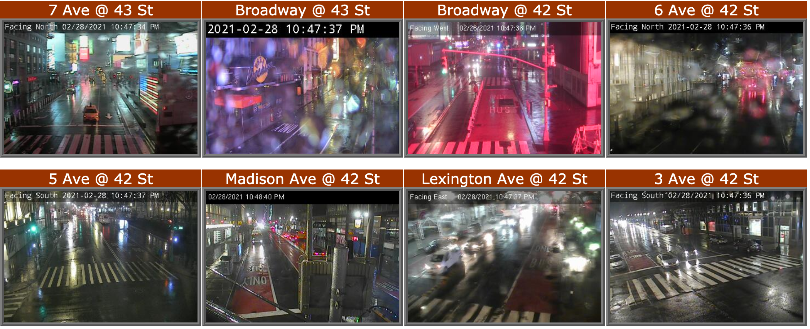

# JABCams


# Install
```bash
git clone https://github.com/djberenberg/JABCams
cd JABCams
```

# Running
To start up one of the viewers, open that directory and click on the `.html` file, it should open in your default browser.


